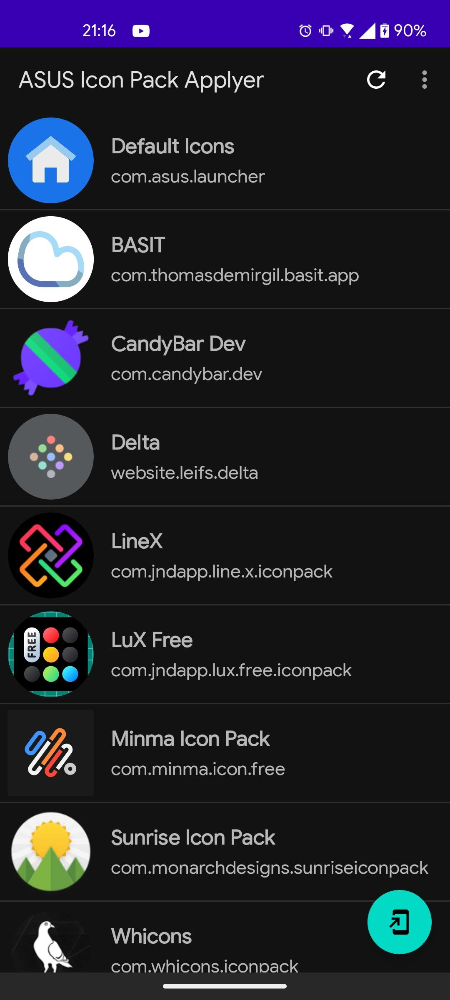

## ASUS Icon Pack Applyer

This app lets you set any icon packs in the default ASUS Launcher (or ZenUI Launcher).

Just select the icon pack from the list, and press Apply

Credits to [Lawnchair](https://github.com/LawnchairLauncher/lawnchair) for Icon Pack detection code and to [CandyBar](https://github.com/zixpo/candybar) for code on how to apply the icon pack to the ASUS Launcher